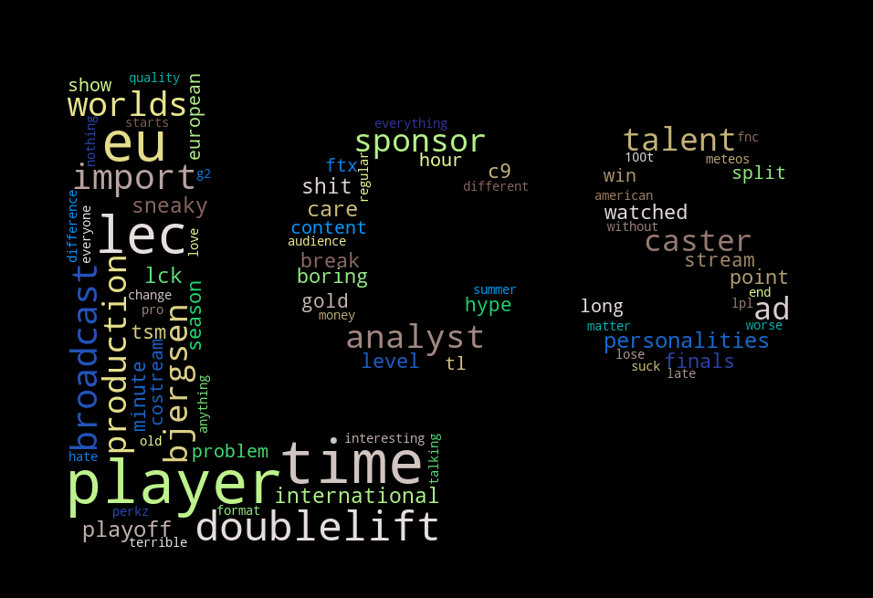

# Decline in LCS Viewership Word Cloud

## Background
 An [article](https://dotesports.com/league-of-legends/news/2021-lcs-summer-split-lowest-peak-viewership-count-any-lcs-season-last-5-years) was recently released saying that the 2021 LCS Summer Split had the lowest peak viewership count of any LCS season over the last five years. This information was not surprising to many viewers of the LCS, as viewer counts on Youtube and Twitch were very visibly lower than usual. There are many reasons for this decline in viewership, and users in the r/leagueoflegends subreddit posted their thoughts on why this may happening, or why they no longer watch the games, in a [reddit post](https://www.reddit.com/r/leagueoflegends/comments/pf0rwq/the_2021_lcs_summer_split_had_the_lowest_peak/) that amassed over 1,000 comments.

## Purpose
 As an avid viewer of the LCS myself, I was curious to know what people thought were the reasons for the decline. Using the reddit API, I decided to pull all the comments in the reddit thread, and create a word cloud that would summarize the most frequently used words. Most of the time was spent on processing the text in a way that would show accurate insights. This includes identifying as many stop words as possible, and aggregating similar references together (ex. both "dl" and "dlift" refer to the player "Doublelift").

## Results

